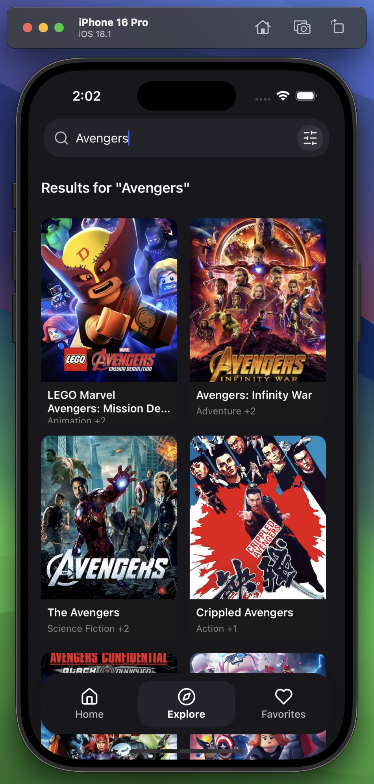

# Movie Explorer 🎬

A modern React Native mobile application that allows users to explore and discover movies using the TMDb (The Movie Database) API. Built with Expo and React Native, this app provides a seamless movie browsing experience with features like infinite scrolling, search, and detailed movie information.

## Screenshots 📱

<div align="center">
  <table>
    <tr>
      <td></td>
      <td></td>
      <td></td>
      <td></td>
    </tr>
    <tr>
      <td></td>
      <td></td>
      <td></td>
      <td></td>
    </tr>
  </table>
</div>

## Features ✨

- **Movie Discovery**

  - Browse trending and popular movies
  - Infinite scroll pagination
  - Pull-to-refresh functionality
  - Movie search with real-time results

- **Explore Page**

  - Discover new and upcoming movies
  - Filter movies by genre

- **Favorites Page**

  - Save your favorite movies for quick access
  - Offline access to favorite movie details

- **Movie Details**

  - Comprehensive movie information
  - Cast and crew details
  - Movie ratings and reviews
  - Similar movie recommendations
  - Add/remove from favorites
  - Share movie information

- **User Experience**
  - Smooth animations and transitions
  - Responsive design for all screen sizes
  - Offline support with cached data
  - Gesture-based interactions

## Tech Stack 🛠

- **Framework**: React Native with Expo
- **State Management**: Zustand
- **Navigation**: Expo Router (file-based routing)
- **API Integration**: TMDb API
- **Styling**: Stylesheets
- **Data Fetching**: React Query
- **Caching**: AsyncStorage
- **Type Safety**: TypeScript

## Prerequisites 📋

- Node.js (v16 or higher)
- npm
- Expo CLI
- iOS Simulator (for Mac) or Android Emulator
- TMDb API Key (get it from [TMDb](https://www.themoviedb.org/documentation/api))

## Setup Instructions 🚀

1. **Clone the repository**

   ```bash
   git clone <repository-url>
   cd MovieExplorer
   ```

2. **Install dependencies**

   ```bash
   npm install
   ```

3. **Environment Setup**
   Create a `.env` file in the root directory and add your TMDb API key:

   ```
   EXPO_PUBLIC_TMDB_API_KEY=your_api_key_here
   EXPO_PUBLIC_TMDB_BASE_URL=https://api.themoviedb.org/3
   ```

4. **Start the development server**

   ```bash
   npm run start
   ```

5. **Run on your preferred platform**
   - Press `i` for iOS simulator
   - Press `a` for Android emulator
   - Scan QR code with Expo Go app for physical device

## Project Structure 📁

```
MovieExplorer/
├── app/                    # Main application code
│   ├── screens/           # Screen components
│   ├── movie/             # Movie-related screens and components
│   ├── _layout.tsx        # Root layout configuration
│   └── index.tsx          # Entry point
├── components/            # Reusable components
│   ├── AppLayout.tsx      # Main app layout component
│   ├── BottomNav.tsx      # Bottom navigation component
│   ├── CategoryChips.tsx  # Category selection chips
│   ├── Header.tsx         # App header component
│   ├── MovieCardCarousel.tsx # Movie carousel component
│   └── SearchBar.tsx      # Search functionality component
├── hooks/                 # Custom React hooks
├── store/                # Zustand store configurations
├── types/                # TypeScript type definitions
├── utils/                # Utility functions
├── assets/              # Static assets (images, fonts)
├── .expo/               # Expo configuration files
├── .vscode/            # VS Code configuration
├── app.json            # Expo app configuration
├── eslint.config.js    # ESLint configuration
├── tsconfig.json       # TypeScript configuration
└── package.json        # Project dependencies and scripts
```

## State Management 🔄

The app uses Zustand for state management with the following stores:

- `useMovieStore`: Manages movie list and search state
- `useFavoritesStore`: Handles user's favorite movies
  - Add/remove movies from favorites
  - Persist favorites using AsyncStorage

## API Integration 🌐

The app integrates with TMDb API for:

- Movie listings and details
- Search functionality
- Cast and crew information
- Movie recommendations

## Performance Optimizations ⚡

- Implemented infinite scrolling with virtualization
- Image caching and lazy loading
- Optimized re-renders using React.memo and useMemo
- Efficient state updates with Zustand
- Background data prefetching

## Testing 🧪

Run the test suite:

```bash
npm test
```

## Contributing 🤝

1. Fork the repository
2. Create your feature branch (`git checkout -b feature/AmazingFeature`)
3. Commit your changes (`git commit -m 'Add some AmazingFeature'`)
4. Push to the branch (`git push origin feature/AmazingFeature`)
5. Open a Pull Request

## License 📝

This project is licensed under the MIT License - see the [LICENSE](LICENSE) file for details.

## Acknowledgments 🙏

- [TMDb](https://www.themoviedb.org/) for providing the movie database API
- [Expo](https://expo.dev/) for the amazing development platform
- [React Native](https://reactnative.dev/) community for the excellent documentation and support
